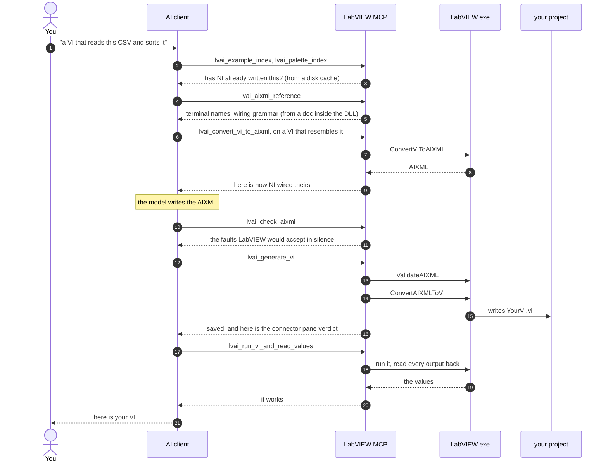

# LabVIEW MCP

**An AI assistant that can read, write and run the LabVIEW code on your machine.**

[**Quickstart**](#quickstart) · [What you can ask for](#what-you-can-ask-for) · [Under the hood](#under-the-hood) · [Status](#status-research-grade-and-honest-about-it) · [Install another way](docs/guide/install.md) · [All the docs](docs/README.md)


<details>

<summary>⚠️☠️🚨 Read this before you let a robot touch your VIs ⚠️☠️🚨</summary>

>
> **Not affiliated with, endorsed by, or supported by NI or Emerson.** Nobody at NI asked for
> this, nobody at NI owes you anything for it, and nobody at NI is on the hook when it misbehaves.
>
> **The plumbing is theirs, and it is public.** The server inside LabVIEW is
> [ni/grpc-labview](https://github.com/ni/grpc-labview), NI's own open source, MIT licensed gRPC
> stack. Nothing was cracked open to get here. It is a *generic* server, which is rather the
> point: it serves whatever schema LabVIEW registers into it at runtime, and it ships with gRPC
> reflection switched on so that a client can ask what that is. We asked. It answered.
>
> **What it happens to be serving is another matter.** `lvai.LVAI` is not a published NI API.
> No `.proto` in the install, no documentation, no version policy, and no promise that any of
> these RPCs will still be there next quarter. NI's own repo already warns that generated names
> are subject to change and that none of it is covered by NI Technical Support. Believe them.
> They are being polite about it.
>
> ### Therefore
>
> * **It will break, and probably on a Tuesday.** A LabVIEW update, a tweak to the AI feature, a
>   shifted comma in the AIXML dialect, a new .NET runtime, your MCP client developing opinions.
>   Any one of those is enough. After every LabVIEW upgrade, run `lvai_dump_schema` and find out
>   what moved while you were asleep.
> * **When it breaks, it is not a LabVIEW bug.** Please do not open a ticket with NI about a tool
>   NI did not write and cannot see. That burns an engineer's afternoon and gets you nowhere.
>   Open an issue here instead, where somebody knows what actually happened.
> * **Nobody is liable for the outcome.** Not NI, not Emerson, not Zühlke, not whoever last
>   touched `main`. Lost work, mangled projects, a generated VI that confidently drives real
>   hardware into a wall: all yours. See [`LICENSE`](LICENSE), specifically the part in shouty
>   capitals about no warranty of any kind.
> * **This writes and runs code on your machine.** Work on copies. Commit first. Keep the
>   mutating tools behind a confirmation prompt, and do not allow-list the whole server just
>   because the prompts are irritating. They are irritating on purpose.
>
> LabVIEW, NI and ni.com are trademarks of National Instruments Corporation, used here only to
> say which software this thing talks to.


</details>

## What you can ask for

A `.vi` is a binary file. You cannot grep it. A diff of two versions tells you only that they
differ. No amount of clever prompting will get a language model to emit one. So the last few years
of assistants writing everybody else's code politely skipped LabVIEW.

LabVIEW MCP borrows the IDE's own hands. It drives a running LabVIEW 2026 and exposes it over
[MCP](https://modelcontextprotocol.io), so a VI becomes something an assistant can read as text and
produce as text. Once it is connected:

| | |
|---|---|
| **Read** | *"What does this VI do?"* The block diagram comes back as text: nodes, wires, terminals, structures. A whole `.lvproj` or `.lvlib` too. |
| **Write** | *"Give me a VI that reads this file and sorts it."* Generated, validated, saved as a real `.vi`. |
| **Edit** | *"Add error handling to this VI."* The existing diagram is changed in place. |
| **Run** | *"Does it actually work?"* Executed as a top-level VI, with the outputs read back. |
| **Build** | A build specification in a project is executed and its output written. |
| **Reuse** | Your installed palettes and NI's shipping examples are searchable, so the answer is an existing VI wherever one exists. OpenG, MGI and JKI are included if you have them. |
| **Document** | A bundled agent turns a library, class or project into a Word document, with a structure diagram and a section per public VI. |

Every item on that list is something the IDE could already do. The trick is that a text-shaped
thing can now ask for it.

## Under the hood

Four processes, all of them yours, none of them on the internet. The assistant talks to a small
local translator, and the translator talks to LabVIEW.

```
     YOU
      │   "give me a VI that reads this CSV and sorts it"
      ▼
 ┌────────────────────────────┐
 │        AI CLIENT           │  Claude Code · Claude Desktop · Cursor · Codex · Copilot,
 │                            │  or your own agent wrapped around a local LLM.
 └─────────────┬──────────────┘
               │  MCP, spoken as JSON-RPC over stdin and stdout. The client starts
               │  the server as a child process and asks it, once per session,
               │  what it can do.
               ▼
 ┌────────────────────────────┐
 │       LabVIEW MCP          │  LabVIEWMCP.exe, one Windows executable with 84 tools.
 │                            │  This is where the knowledge lives: the AIXML dialect,
 │      the translator        │  the palette and example indexes, the VI Server catalogue.
 └──────┬──────────────┬──────┘
        │              │
   ENGINE 1        ENGINE 2
   lvai.LVAI       pylabview
   gRPC/HTTP-2     bundled. It opens the .vi
   on 127.0.0.1    container and rewrites it.
        │              │
        ▼              │
 ┌────────────────┐    │   The port is picked when LabVIEW starts and rediscovered
 │  LabVIEW.exe   │    │   every session. You never configure it, and you cannot.
 │ ┌────────────┐ │    │
 │ │ lvai.LVAI  │ │    │   The gRPC server runs INSIDE LabVIEW: NI's own grpc-labview,
 │ │  service   │ │    │   loaded by the AI add-on. With LabVIEW closed, engine 1 is
 │ └────────────┘ │    │   unavailable, and engine 2 is what you have left.
 └───────┬────────┘    │
         │             │
         ▼             ▼
    ┌─────────────────────┐
    │     YourVI.vi       │  a real binary VI on disk, openable in the IDE,
    └─────────────────────┘  indistinguishable from one you drew yourself
```

### One request, end to end

Here is the whole conversation behind *"give me a VI that reads this CSV and sorts it"*. Watch how
many of the arrows stop at the server.



Four of those calls reach LabVIEW. The rest the server answers out of a disk cache or out of a
document compiled into its own DLL, which is why a session feels brisk right up to the generate
step and then stops to think.

Step 4 earns its place in there. Terminal names in AIXML are literal LabVIEW labels, and several of
them are surprising: `Increment` is `x+1`, while `Greater?` is `x > y?` with the spaces. An
assistant that guesses collects an error from the validator. An assistant that looks them up gets a
VI.

The generate step is the first one that writes anything, and it is the one your client should be
asking you about. Reads carry `readOnlyHint` and can be allow-listed. Writes carry
`destructiveHint` and prompt every time. The full loop, including the parts verification cannot
see, is in [docs/guide/aixml-workflow.md](docs/guide/aixml-workflow.md).

### Two engines, because one of them needs a licence

Engine 1 needs LabVIEW running. Engine 2 needs nothing at all, not LabVIEW, not a licence, not even
a Python install, because a bundled copy of
**[pylabview](https://github.com/mefistotelis/pylabview)** takes the `.vi` container apart and puts
it back together itself. It reaches everything AIXML has no words for: icons, front-panel layout,
decorations, `.ctl` files, connector-pane patterns, and the diagram of a VI whose constructs
LabVIEW's own generator flatly refuses to read.

The two have separate jobs, and the dependency runs one way:

| | |
|---|---|
| **AIXML**, via LabVIEW | **Creates and names.** The only way to author a VI from nothing at all. |
| **pylabview** | **Edits and reads.** It changes what is already there, byte for byte. It cannot invent a node or a wire. |

`pylv_route` picks between them per VI and tells you why. Which turns out to matter more than it
sounds. Measured across 900 VIs of a production codebase, only **15 %** can be regenerated through
AIXML at all. Seventy per cent call the project's own subVIs, which the generator rejects outright.
When you are editing existing code, pylabview is the normal route and AIXML is the exception.

## Status: research-grade, and honest about it

This works, and it has never been near a production validation cycle. Everything documented in this
repository was measured on a real installation, by its authors, on one station.

What that means in practice: the writing tools overwrite a `.vi` without asking. Regenerating a VI
throws away its diagram layout, its decorations and its icon. And the interface underneath is NI's
private one, so a LabVIEW upgrade is a coin toss.

**Work on copies. Commit first.** Version control is the only undo there is.

The unabridged version is in **[docs/guide/safety.md](docs/guide/safety.md)**, including what
`ApplyAIXMLToVI` does instead of working, and the one class of edit that took `LabVIEW.exe` down on
load. Worth ten minutes before the first write.

## Quickstart

**You need:** Windows x64, **[Claude Code](https://claude.com/claude-code) ≥ 2.1.224**, and
**LabVIEW 2026 Q3**. LabVIEW has to be running before you use the tools, though not to install
them.

### Installation

Open a terminal in your LabVIEW project folder:

```powershell
claude plugin marketplace add Zuehlke/labview-mcp
claude plugin install labview-mcp@zuehlke-labview
```

### Update

Once installed, run these commands to update the plugin to the latest release:

```powershell
claude plugin marketplace update zuehlke-labview
claude plugin update labview-mcp
```


That is the whole setup. No clone, no build, no config file to hand-edit. Claude Code pulls a
prebuilt Windows binary from the
[latest release](https://github.com/Zuehlke/labview-mcp/releases/latest) and you get the server,
eight LabVIEW agents (`labview-vi-generator`, `labview-vi-editor`, `labview-doc-generator`,
`labview-class-generator`, `labview-dqmh-module`, and one per unit-test framework), and an
allow-list that lets reads run uninterrupted while every mutating tool still stops to ask.

Start LabVIEW, open Claude Code in your project, and try:

> *"Call `lvai_status` to check the LabVIEW connection, then tell me what `C:\path\to\My.vi`
> does."*


On Claude Code older than 2.1.224 the install complains about an unsupported source type. Upgrade,
or take the manual route. If you are not using the plugin, or you are driving this from something
other than Claude, then Codex, Copilot, Cursor, a local LLM and a binary-only install on a machine
with no repository are all covered in [docs/guide/install.md](docs/guide/install.md).

## Where to go next

| I want to… | Read |
|---|---|
| install some other way | [docs/guide/install.md](docs/guide/install.md) |
| know what it can destroy before I let it | [docs/guide/safety.md](docs/guide/safety.md) |
| see every tool, and which are safe to allow-list | [docs/guide/tools.md](docs/guide/tools.md) |
| generate or edit a VI properly | [docs/guide/aixml-workflow.md](docs/guide/aixml-workflow.md) |
| write AIXML by hand | [docs/aixml-reference.md](docs/aixml-reference.md) |
| fix a connection that will not connect | [docs/guide/troubleshooting.md](docs/guide/troubleshooting.md) |
| build, test, release, or find my way around | [CONTRIBUTING.md](CONTRIBUTING.md) |
| have an assistant work in here without breaking things | [CLAUDE.md](CLAUDE.md) |

Beyond the guides, [`docs/`](docs/) is a lab notebook. Fifty-odd pages of measurements, each one
written up because it had just cost somebody an afternoon: crash signatures, the class and
interface tooling, fifteen cold-build post-mortems, connector-pane tables.
[`docs/README.md`](docs/README.md) sorts them by what you are trying to find out.

## Credits and third-party code

### pylabview, with thanks

The `pylv_*` tools exist because of
**[pylabview](https://github.com/mefistotelis/pylabview)**, and the debt is worth stating plainly.
The hard part of this project's second engine was understanding LabVIEW's `RSRC` container and its
object heaps well enough to take a `.vi` apart and put it back together byte-for-byte, and that was
already solved there, by other people, years ago. Nothing in this repository reverse-engineers a
`.vi` file format. It reads one through their work.

Thank you to **Mefistotelis**, who wrote it. It is a decade of patient, unglamorous file-format
archaeology, given away for free, and it turned "an assistant cannot edit a VI without a LabVIEW
licence" into something that is simply not true any more.

| | |
|---|---|
| Project | [mefistotelis/pylabview](https://github.com/mefistotelis/pylabview) |
| Authors | Jessica Creighton (2013), Mefistotelis (2019 to 2020), as the licence names them |
| Licence | MIT. Full text in `tools\pylabview\vendor\LICENSE-pylabview.txt` |
| Pinned commit | `69768647c18d2d792a259b69884b2433761c3a4f` (2026-07-30) |
| Local changes | **none**, as described below |

**Upstream is vendored unmodified, deliberately.** `tools\pylabview\vendor\pylabview\` is
byte-identical to that commit, so upstream fixes can be taken by copying the package over it.
Everything this project needed on top was added from the outside instead. The primitive and
terminal names pylabview does not carry are written in as inert XML comments by
`experiments\pylabview\annotate_names.py`. The one upstream defect encountered was a crash on VIs
whose probe table is not a `RepeatedBlock`, measured at 32 of 900 VIs in a production codebase, and
it is applied to the assembled copy through `tools\pylabview\patches\patches.json` and never to
`vendor\`. `tools\pylabview\VENDOR.md` has the provenance and the reasoning.

If you use this server's editing tools, you are using their code. Please star their repository.

### NI's grpc-labview

The `lvai.LVAI` transport is NI's own open-source
[grpc-labview](https://github.com/ni/grpc-labview), which is what makes the interface reachable at
all. The next section has the details.

## Where the interface comes from

`labview_grpc_server.dll`, shipped in the `lvai` LVAddon, is NI's open-source
[grpc-labview](https://github.com/ni/grpc-labview). It is a *generic* gRPC server, which is why no
`.proto` ships with it: the schema is registered from LabVIEW at runtime.

That server has **gRPC server reflection** compiled in, so the schema was recovered by asking the
running LabVIEW itself. The result is in
[`Protos/lvai_grpc_interface.proto`](src/LabVIEWMCP/Protos/lvai_grpc_interface.proto). It compiles
with `protoc`, and its generated stubs return live data.

`lvai_dump_schema` re-reads the schema from whatever LabVIEW is running, so you can catch drift
instead of trusting this checked-in copy.
